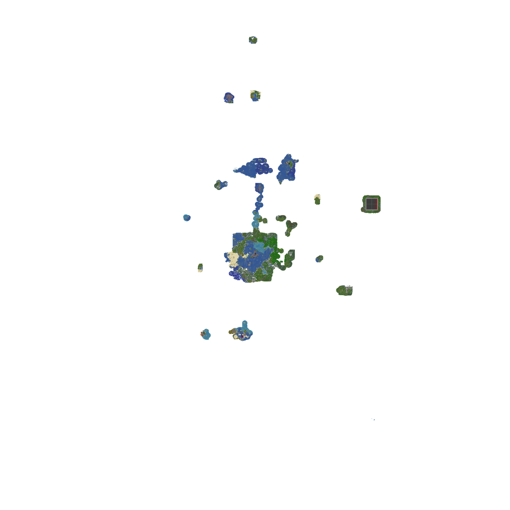

I’ll be upgrading the *entire* world from 1.16.5 to 1.18.1, this means that every chunk we haven’t built in will have the new 1.18 generation. The goal is to do this without loosing any progress from any player. The rest of this page will be dedicated to answering questions and providing information about how you can make sure your base/builds/intended areas can be transferred **even after the upgrade**. 

{/* truncate */}

## Chunk Merging

With 1.18 Mojang implemented a new DFA (Data Fixer Upper) feature that merges old and new chunks together when you upgrade a world. This prevents the old world generation cliffs that we would get when a new biome was added or the world generation was changed in some other significant way. 

What this also means is that I can purge all of the chunks that we haven’t built , keeping the ones that we have, and the game will cleanly merge the new 1.18 generation with the terrain that already exists! We can have a whole 1.18 world with our current builds. 

## Make sure your base is kept

This won’t affect the current generation above Y0 in the chunks that I keep, so when picking out the chunks that I keep I have to be specific. What I’m doing is picking out all chunks that have been loaded by a player for more than 5 minutes and then manually reviewing the area to see if there are any player builds or if it’s just a resource area. I’m pruning the latter from the selection and keeping the former. But I’m not perfect so I may have missed a base and pruned it, and you may have plans for an area you haven’t visited and/or built at. But don’t worry! I can add 1.16.5 chunks back to the world any time after we’ve upgraded to 1.18 and I’ll always keep the world on hand if anyone needs it!

Just let me know if your base is missing from the image below and I’ll grab it from the world and upload it to the server! I’ll make sure to update the image with new bases that I add back too, just to make sure we’re all on the same page \<3

